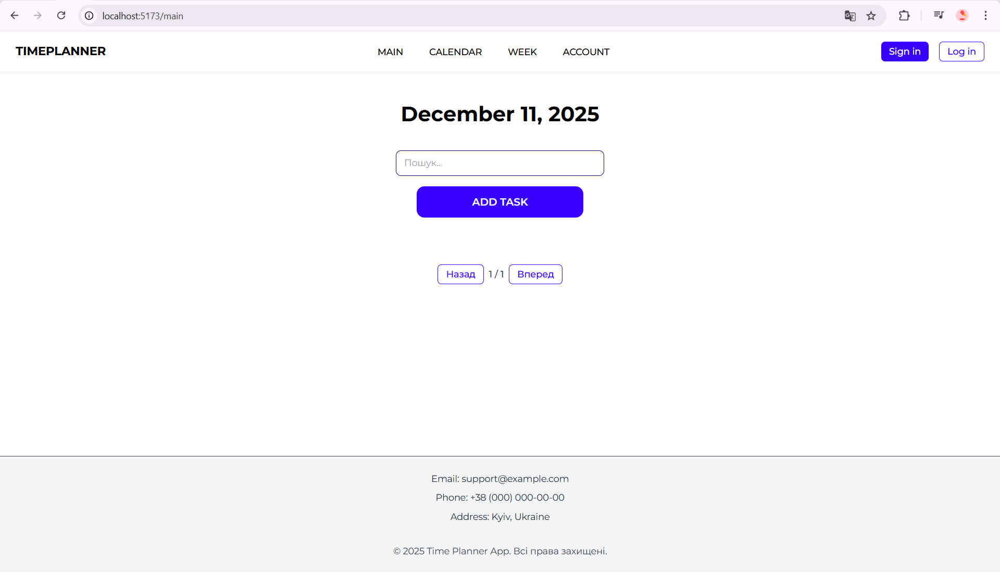
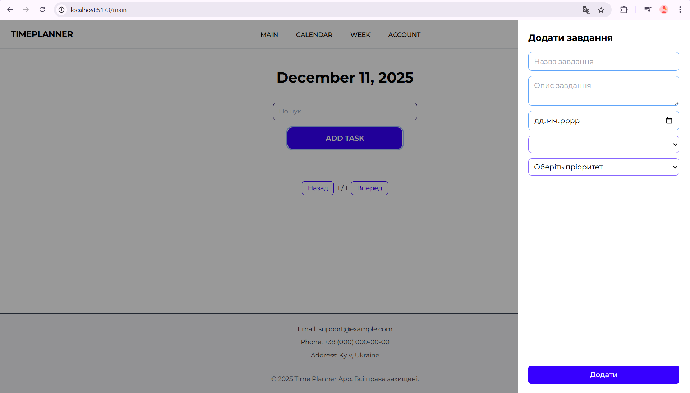
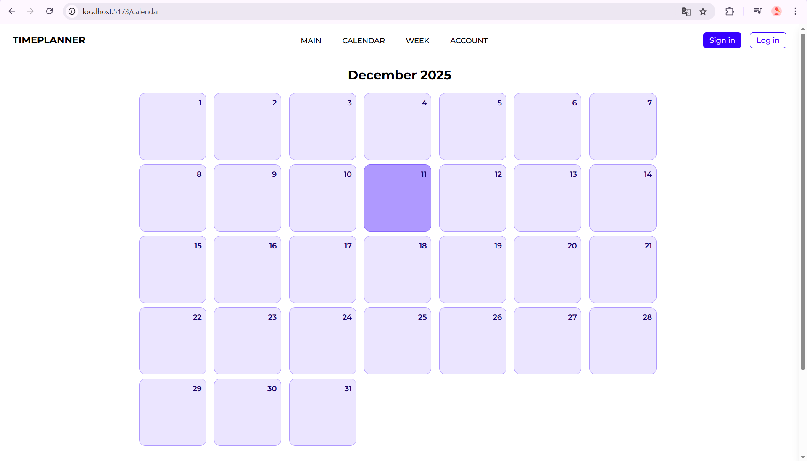

# Назва проєкту
Time Planner

## Опис проєкту
Застосунок призначений для планування та управління особистими завданнями. Користувач може додавати, редагувати, видаляти та сортувати завдання за датою, пріоритетом та категорією, переглядати їх у вигляді списку або календаря.

## Технології
- Vue.js 
- TypeScript
- Vite
- Tailwind CSS
- Vue Router
- Axios
- ESLint + Prettier

## Встановлення та запуск

### Вимоги
- Node.js 18+
- npm або yarn

### Інструкції
\`\`\`bash
# Клонування репозиторію
git clone [URL репозиторію]

# Встановлення залежностей
npm install

# Копіювання .env файлу
cp .env.example .env

# Запуск у режимі розробки
npm run dev

# Збірка для продакшену
npm run build
\`\`\`

## Структура проєкту
\`\`\`
src/
├── assets/          # Картинки, стилі
├── components/      # Переусні UI компоненти
├── pages/           # Компоненти сторінок
├── router/          # конфігурація маршрутизації
├── services/        # API сервіси
├── styles/          # Теми
├── types/           # TypeScript типи
├── utils/           # Utility функції
├── App.vue          # Кореневий компонент
├── env.d.ts         # Оголошення модулів
├── main.ts          # Підключення router
\`\`\`

## Скріншоти

## Автор
Маляр Вероніка ІПЗ-42